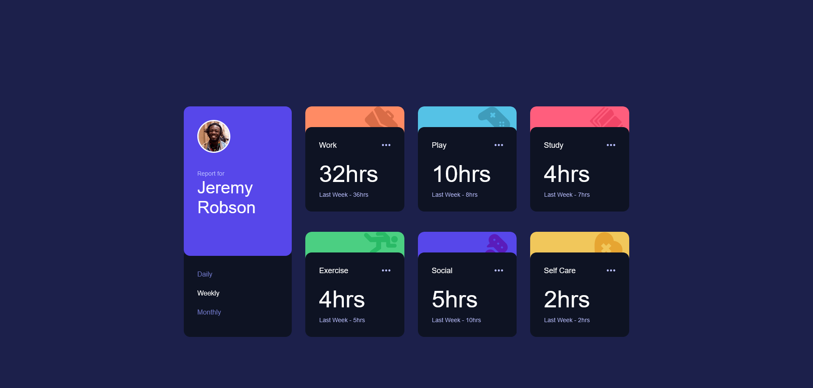
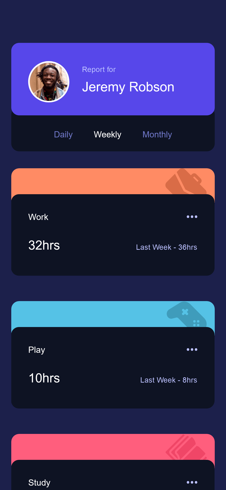

## Time Tracking Dashboard — Frontend Mentor Challenge

A responsive, data-driven dashboard built with semantic HTML, modular SCSS architecture, and vanilla JavaScript. This project simulates a frontend architecture pattern found in modern frameworks like Angular — with dynamic JSON parsing, reactive UI state, and MVC-lite separation of concerns.

[🔗 Live Demo](https://kellenkjames.github.io/time-tracking-dashboard/)

---

## Features

- Responsive layout using **CSS Grid** with mobile + desktop views
- Semantic, accessible HTML5 with visually hidden labels
- Timeframe filter toggle (Daily / Weekly / Monthly)
- Dynamic data rendering using parsed `data.json`
- State management via `model.js`
- View templating via `view.js` (DOM-only rendering)
- UI orchestration via `controller.js` (event binding and updates)
- Modular SCSS using **design tokens**, mixins, and BEM conventions
- Angular-style architecture using vanilla JS foundations

---

## Tech Stack

- HTML5
- SCSS (BEM, Tokens, Mixins, Responsive Utilities)
- JavaScript (ES6+, MVC-lite architecture, JSON parsing)
- Git / GitHub
- GitHub Pages (Deployment)
- Figma (Design Reference)

---

## Screenshots

| Desktop                                                     | Mobile                                                    |
| ----------------------------------------------------------- | --------------------------------------------------------- |
|  |  |

---

## Project Structure

<pre> ``` time-tracking-dashboard/ ├── index.html ├── data/ │ └── data.json           # Simulated API response ├── assets/ │ ├── images/             # Static icons and images │ └── screenshots/        # Final project screenshots ├── js/ │ ├── model.js           # App state management (timeframe logic) │ ├── view.js            # UI rendering logic (DOM templates) │ ├── controller.js      # Event handling and state orchestration │ └── main.js            # App initialization ├── scss/ │ ├── abstracts/         # Tokens, mixins, breakpoints │ ├── base/              # Reset + global styles │ ├── layout/            # Grid layout and responsive structure │ ├── components/        # Card, header, filter nav │ └── main.scss ├── style.css            # Compiled CSS output └── README.md ``` </pre>

---

## Getting Started

1. Clone the repository:
   `git clone https://github.com/yourusername/time-tracking-dashboard.git`

2. Navigate to the project directory:
   `cd time-tracking-dashboard`

3. Compile SCSS to CSS (if using the CLI):
   `sass scss/main.scss style.css`

4. Open `index.html` in your browser to preview the layout.

---

## ⏱️ Time Estimates

| Task                                 | Time Spent |
| ------------------------------------ | ---------- |
| Initial Setup & File Scaffolding     | 1 hr       |
| Layout & CSS Grid System             | 2 hrs      |
| JSON Parsing & Card Rendering Logic  | 2 hrs      |
| Timeframe Toggle & State Transitions | 2 hrs      |
| Final Polish (Animations, QA, Docs)  | 2 hrs      |
| **Total**                            | **~9 hrs** |

---

## Key Learnings

- Building a **reactive dashboard** using only vanilla JavaScript and JSON

- Structuring multi-file JavaScript projects using the **MVC-lite pattern**

- Managing UI state changes and conditional DOM rendering dynamically

- Applying **CSS Grid** for scalable, flexible layout across devices

- Using design tokens and SCSS mixins to enforce consistency across components

- Laying the groundwork for Angular development by practicing component-based thinking and logic separation

---

## Improvements (If time allowed)

- Add fade transitions or staggered animation when switching timeframes

- Extract JSON logic into a reusable data service module

- Add accessibility enhancements like ARIA live regions or keyboard focus tracking

- Convert cards into reusable classes/components with prop-style rendering methods
